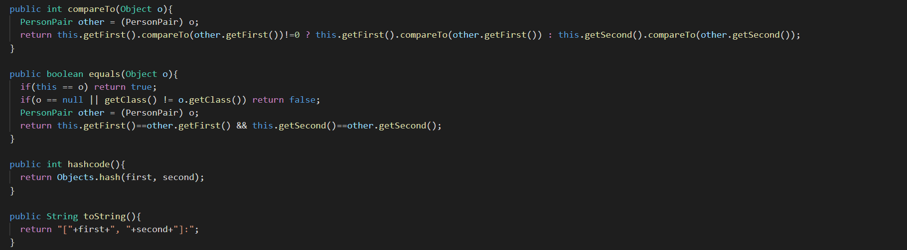
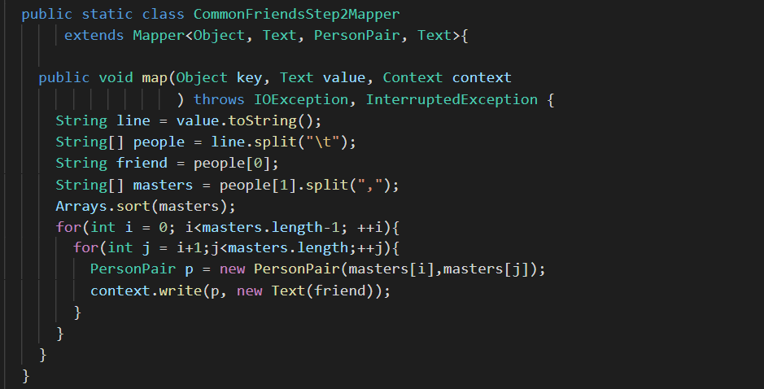
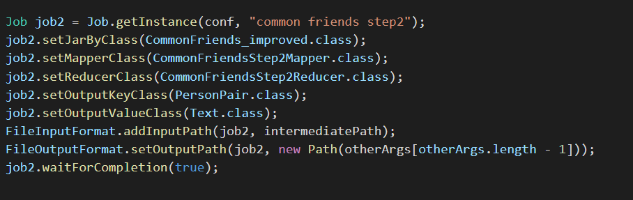
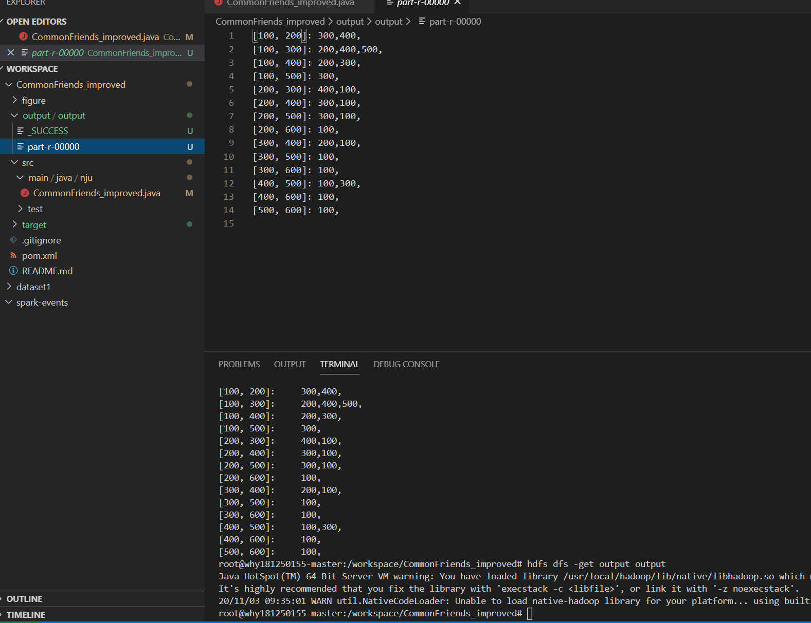
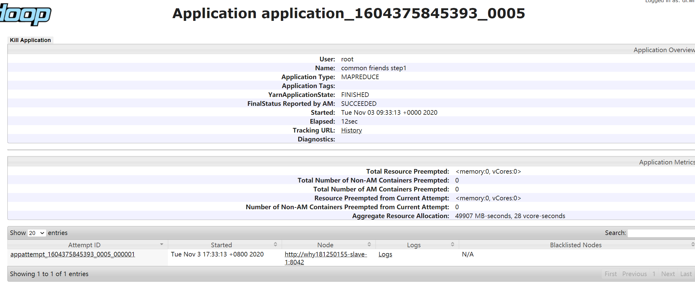
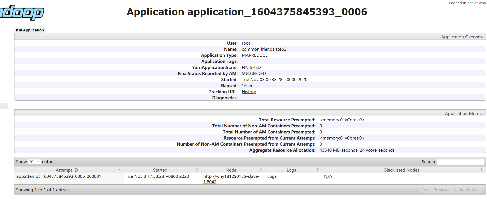

# 金融大数据 作业6 （自定义数据类型）
####  吴泓宇 181250155

## 设计思路

我们先来分析基本数据类型的不足之处，不难发现，最后输出的共同好友的key完全是通过字符串拼接而成的，这样的代码可复用性差，且不易维护，因此我决定将它封装为一个新的数据类型PersonPair

在MapReduce中，要实现一个新的数据类型，需要实现以下内容：

1. 定义私有变量
2. setter，getter方法
3. 无参有参构造器
4. set()方法，帮助构造器初始化数据（Hadoop偏爱）
5. hashCode()方法和equals()方法
6. toString()方法
7. implement Writable并实现write()方法readFilds()方法
8. implement WritableComparable并实现compareTo()方法

我的实现如下

然后，将我们在基本数据类型的实现中做出相应修改：

就可以完成任务

## 一些坑

在实现自定义数据类型类的过程中，起初得到的输出的key直接打印出了PersonPair对象在Hadoop内部的id名称，而不是其对应的值。解决办法有二：

- 一是自定义输出格式，重写OutputFormat
- 二是，经过查阅相关资料发现，Reducer在打印输出时默认调用的是该类型的toString方法，而我之前并没有实现这个方法，所以直接打印出了id，而通过重写这个方法，我们可以无需自己再写一遍OutputFormat就可以达到自定义输出格式的效果

## 实验结果 

Web页面截图

## 总结

作为实验六的第二部分，练习了Mapreduce中自定义数据类型的方法，在一次次尝试与踩坑过程中也对MapReduce更底层的实现有了更真切的认识，知道了每一步输入输出在代码上的依赖分别是什么，收获很大。